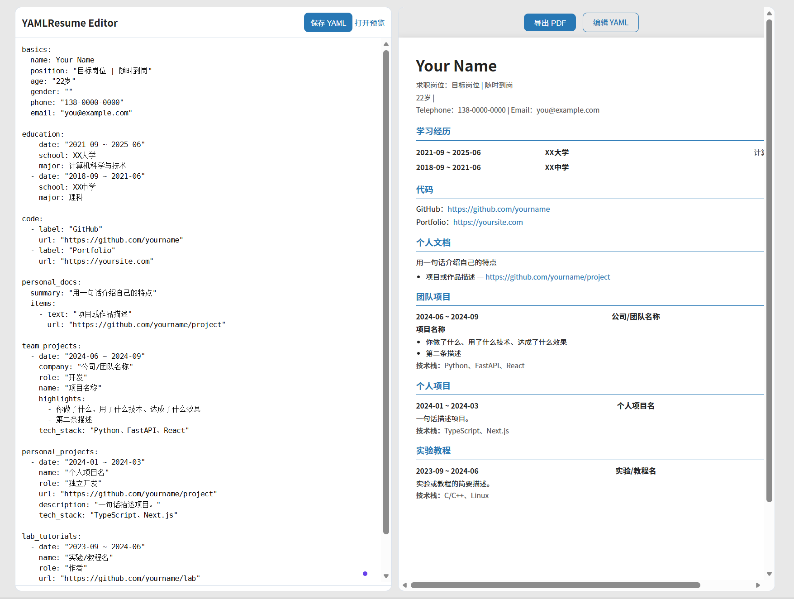
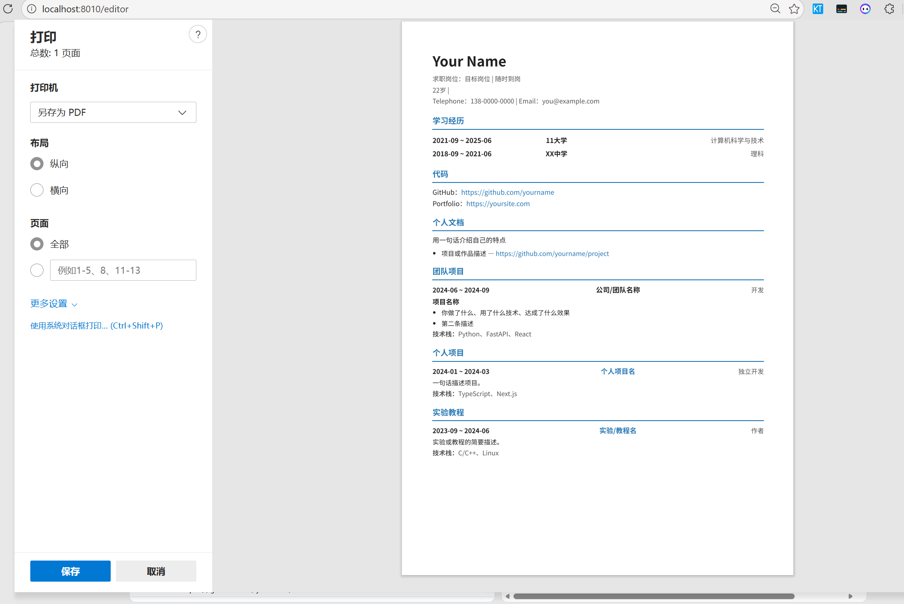

# MyResume

一个 YAML 文件定义所有内容，在线编辑，实时预览，可一键导出 PDF。仓库内置
`generate-resume` Codex Skill，用于根据目标岗位、GitHub 项目、本地仓库和博客证据生成一页 A4 简历。


典型流程：选择目标岗位 → 让 Codex 使用 Skill 深挖项目证据 → 更新 YAML 简历 → 浏览器预览 → 导出一页 PDF。

## Preview

```
http://localhost:8010/resume    ← 简历预览（带「导出 PDF」按钮）
http://localhost:8010/editor    ← 左侧 YAML 编辑 + 右侧实时预览
```





## Quick Start

需要 Python 3.10+ 与 [uv](https://docs.astral.sh/uv/)。

```bash
git clone https://github.com/dahai9/MyResume.git
cd MyResume
uv sync
uv run uvicorn app:app --reload --host 127.0.0.1 --port 8010
```

默认会优先读取根目录 `resume.yaml`；如果不存在，则读取 `examples/my_resume.yaml`。
也可以显式指定简历文件：

```bash
RESUME_FILE=examples/my_resume.yaml uv run uvicorn app:app --reload --host 127.0.0.1 --port 8010
```

也可以使用脚本：

```bash
bash start.sh
```

启动后访问 [http://localhost:8010](http://localhost:8010)。

## How It Works

```
resume.yaml          ← 你的私有简历数据（可选，优先读取，已被 .gitignore 忽略）
examples/my_resume.yaml ← 仓库示例简历，也是默认回退数据
.codex/skills/generate-resume/SKILL.md ← 面向岗位生成简历的 Codex Skill
templates/resume.html ← Jinja2 渲染模板
static/style.css      ← 样式（A4 排版、编辑器布局、打印适配）
app.py                ← FastAPI 服务
pyproject.toml        ← uv 管理的项目依赖
```

## Generate With Skill

本仓库的 Skill 位于 `.codex/skills/generate-resume/SKILL.md`。在 Codex 中打开仓库后，可以直接这样请求：

```text
使用 generate-resume skill，根据这个岗位链接和我的 GitHub/本地项目，优化 examples/my_resume.yaml，要求 A4 一页。
岗位链接：<job-url>
GitHub：<github-user>
```

这个 Skill 会引导 Codex 做几件事：

- 抓取目标岗位，提取岗位关键词和硬性要求。
- 用 `gh` 查询 GitHub 仓库，并优先读取同名本地 checkout 的 README、源码、docs、tests、Skill/Agent 文件。
- 从项目里筛选 3 个最匹配岗位的主项目和 1 个博客/工具链补充项。
- 写入 easyCV 已渲染字段，例如 `basics.position`、`personal_docs.summary`、`personal_projects`、`lab_tutorials`。
- 控制内容密度，避免项目堆砌，最后用浏览器或 PDF 导出校验是否为一页。

详细教程见 [docs/generate-resume-with-skill.md](docs/generate-resume-with-skill.md)。

## Requirements

基础软件：

- Python 3.10+
- `uv`
- Git
- Chrome 或 Edge，用于预览和打印 PDF

推荐软件：

- GitHub CLI `gh`，用于查询近期 GitHub 项目；先执行 `gh auth login`
- `rg`，用于快速搜索本地仓库证据
- Codex，使用仓库内 `.codex/skills/generate-resume` Skill

推荐 MCP/浏览器能力：

- Chrome DevTools MCP：让 Codex 打开岗位页、预览简历、检查页面高度和导出效果
- GitHub CLI 或 GitHub MCP：查询仓库元数据、更新时间、项目描述和公开证据

### 编辑简历

**方式 A**：直接编辑 `resume.yaml`，保存后刷新页面。

**方式 B**：打开 `/editor`，在浏览器内编辑 YAML，点击保存，右侧实时预览。

### 导出 PDF

预览页顶部有「导出 PDF」按钮，点击后调用浏览器打印，选择"另存为 PDF"即可。

> 建议使用 Chrome/Edge，打印时取消页眉页脚，边距选"无"，效果最佳。

## YAML Structure

```yaml
basics:           # 姓名、岗位、联系方式、photo 证件照路径
education:        # 学习经历
code:             # 代码链接（GitHub、作品集等）
personal_docs:    # 个人文档/博客/专栏
team_projects:    # 团队项目（公司、Hackathon 等）
personal_projects: # 个人项目
lab_tutorials:    # 实验教程
```

### 头像图片

照片字段放在 `basics.photo`。浏览器只能加载 Web URL，不能直接读取本机绝对路径。

推荐方式是把图片放进 `static/`，然后使用 `/static/...` 路径：

```text
static/photo.jpg
```

```yaml
basics:
  photo: "/static/photo.jpg"
```

如果是私有头像，也可以把图片放在仓库根目录，例如 `self-portrait.png`，然后写：

```yaml
basics:
  photo: "/self-portrait.png"
```

根目录图片访问是受限的：应用只会暴露根目录下的常见图片扩展名，例如 `.png`、`.jpg`、`.jpeg`、`.webp`、`.gif`、`.avif`，不会暴露 `README.md`、`resume.yaml` 等普通文件。

不要写本机文件路径或未暴露目录：

```yaml
photo: "/home/user/photo.jpg"      # 浏览器无法访问
photo: "examples/photo.jpg"        # examples/ 没有作为静态目录暴露
```

默认 `.gitignore` 会忽略 `resume.yaml`、`*.png`、`*.jpg`、`*.jpeg`，适合存放真实头像和个人简历。留空时页面会在右上角显示“照片”占位。

完整示例见 [`examples/my_resume.yaml`](./examples/my_resume.yaml)。

## API

| Method | Path | Description |
|--------|------|-------------|
| `GET`  | `/resume` | HTML 简历预览 |
| `GET`  | `/editor` | YAML 编辑器 |
| `GET`  | `/api/resume` | JSON 格式简历数据 |
| `PUT`  | `/api/resume` | JSON 覆盖更新 |
| `GET`  | `/api/resume/raw` | 获取原始 YAML |
| `PUT`  | `/api/resume/raw` | 保存原始 YAML |
| `GET`  | `/docs` | OpenAPI 文档 |

## Docker

```bash
docker build -t myresume .
docker run -p 8010:8010 myresume
```

## Acknowledgements

- https://github.com/hijiangtao/resume
- https://github.com/yamlresume/yamlresume
- https://github.com/lvy010/easyCV

## License

MIT
